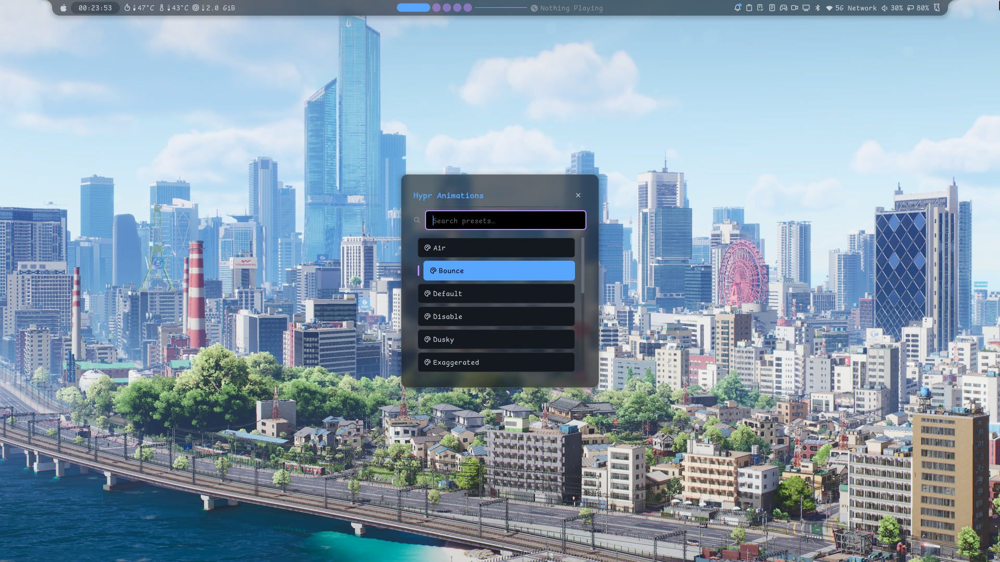
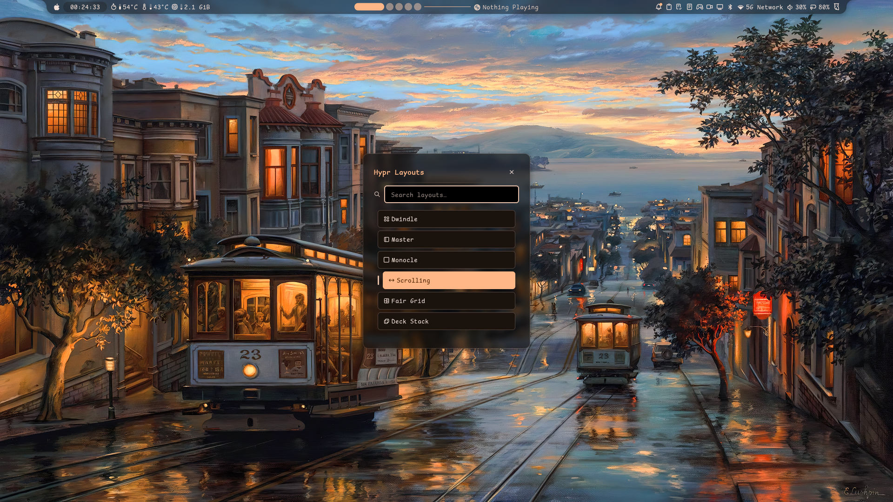
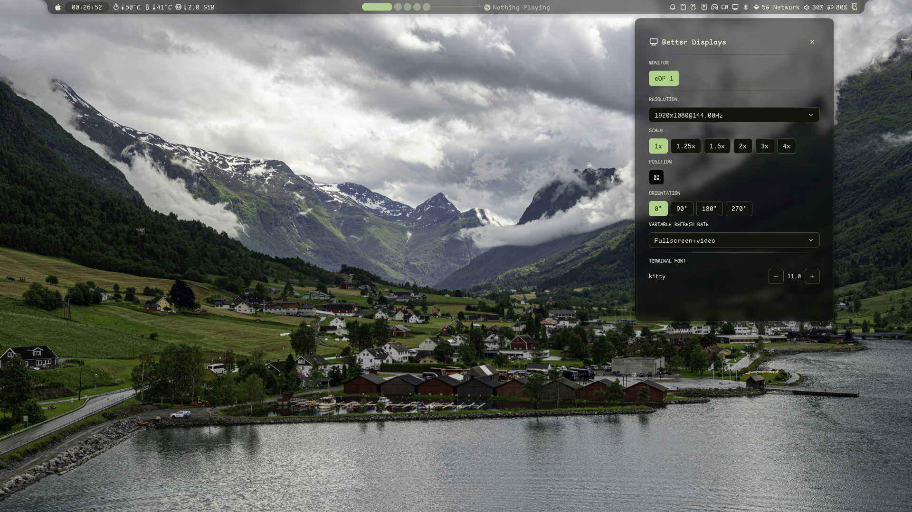
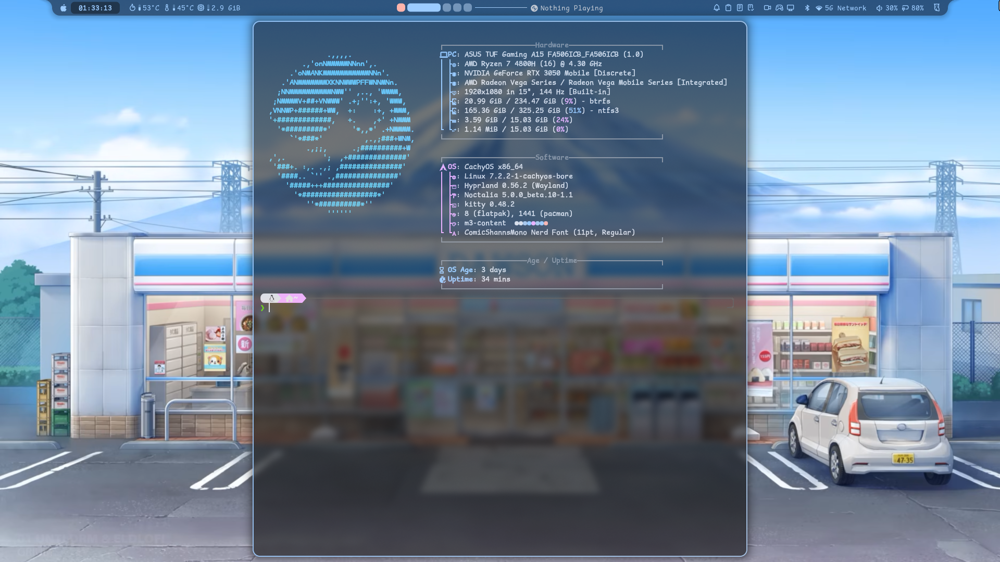

<p align="center">
  <a href="README.id.md">🇮🇩 Bahasa Indonesia</a>
</p>

<h1 align="center">
  🖥️ CachyOS My Dotfiles
</h1>

<p align="center">
  <a href="LICENSE"></a>
  
  
  
  
</p>

<p align="center">
  <b>Simple CachyOS + Hyprland Noctalia dotfiles</b> for the ASUS TUF Gaming A15 (AMD Renoir + NVIDIA RTX 3050, Wayland).
</p>

---

## 📸 Screenshots

<p align="center">
  
</p>

<p align="center">
  
  
</p>

<p align="center">
  
  
</p>

<p align="center">
  
  
</p>

---

## ✨ About

Minimal, opinionated dotfiles for a **CachyOS + Hyprland Noctalia** desktop. Built on the official **CachyOS Hyprland Noctalia** install option — no manual DE building, no "No Desktop" setup.

- **Shell / panel / launcher:** Noctalia (Noctalia Shell v6 style)
- **WM config:** Hyprland Lua API (`hyprland.lua`, loaded via uwsm)
- **Keybinds:** Noctalia/Omarchy-style (`SUPER` modifier)
- **GPU:** default AMD Renoir iGPU (battery), NVIDIA RTX 3050 on-demand for editing/gaming

---

## 🚀 Install CachyOS + Hyprland

Hyprland Noctalia is now a **first-class desktop option** in the CachyOS installer (since the **June 2026 ISO**).

1. Download the desktop ISO: <https://cachyos.org/download/>, and flash it to a USB (e.g. `dd` or Ventoy).
2. Boot the USB, run **CachyOS Hello**, and click **Install**.
3. In the **desktop picker**, select **Hyprland Noctalia** (the pre-configured option).
4. Complete the Calamares installer (partitioning, user, bootloader). Btrfs + Snapper is recommended for rollbacks.
5. After reboot, log in to the **Hyprland (Noctalia)** session.

> The installer now ships Noctalia as a first-class desktop option (joining KDE, GNOME, Niri, i3, bspwm, Sway, Wayfire, Qtile). `paru` was replaced by **Shelly** — use `shelly` for AUR installs.

---

## 📦 Install these dotfiles

Clone and run **one script**:

```bash
git clone https://github.com/tofan79/cachyos-mydotfiles
cd cachyos-mydotfiles
chmod +x mydotfiles.sh
./mydotfiles.sh
```

`mydotfiles.sh` is now **simple and safe** — it only:

1. **Backs up** the existing `~/.config/{fastfetch,hypr,uwsm}` to `~/.config-backup-<timestamp>/`
2. **Copies** those three config dirs from `dotfiles/` into place
3. **Copies** `Wallpapers/` → `~/Pictures/` (backing up any existing files with the same name)
4. Reloads Hyprland

**No sudo. No system changes. No other config touched.** All other config directories (GTK, kitty, cava, MangoHud, …) are left untouched.

---

## 📁 What's in `dotfiles/`

| Folder | Contains |
|--------|----------|
| `dotfiles/hypr/` | Hyprland Lua config + Omarchy keybinds + scripts |
| `dotfiles/uwsm/` | `env` — GPU/env vars, default browser, shell session env |
| `dotfiles/fastfetch/` | Fastfetch config + Noctalia theme |

### Wallpapers

`Wallpapers/` (`BG02.png`, `BG03.png`) are copied to `~/Pictures/`.

---

## ⌨️ Keybindings

All use `SUPER` (Windows key). Defined in `~/.config/hypr/config/binds.lua`.

### Core & Shell

| Key | Action |
|-----|--------|
| `SUPER + Q` | Close window |
| `SUPER + SHIFT + R` | Reload Hyprland |
| `SUPER + Escape` | Session menu (Noctalia) |
| `SUPER + CTRL + L` | Lock screen |
| `SUPER + Space` | App launcher (Noctalia panel) |
| `SUPER + CTRL + Space` | Settings toggle |
| `SUPER + CTRL + comma` | Clear clipboard |
| `SUPER + CTRL + C` | Caffeine toggle |
| `CTRL + SHIFT + Escape` | btop system monitor |
| `SUPER + /` | System monitor (procmon) |

### Windows & Layout

| Key | Action |
|-----|--------|
| `SUPER + arrows` | Smart focus |
| `SUPER + SHIFT + arrows` | Smart swap |
| `SUPER + CTRL + up/down` | Prev / next workspace |
| `SUPER + F` | Toggle fullscreen |
| `SUPER + SHIFT + F` | Maximize |
| `SUPER + SHIFT + T` | Toggle floating |
| `SUPER + ALT + T` | Toggle floating + pinned |
| `SUPER + CTRL + R` | Enter resize mode |
| `ALT + Tab` | Cycle windows |
| `SUPER + CTRL + K` | (Dwindle) swap split |
| `SUPER + CTRL + J` | (Dwindle) toggle split |
| `SUPER + CTRL + M` | (Master) cycle orientation |

### Groups

| Key | Action |
|-----|--------|
| `SUPER + SHIFT + G` | Toggle window group |
| `SUPER + CTRL + G` | Out of group |
| `SUPER + CTRL + [` / `]` | Into group left / right |
| `SUPER + ALT + ]` / `[` | Into group up / down |
| `SUPER + Tab` / `SHIFT + Tab` | Group next / prev |
| `SUPER + CTRL + 1-9` | Group index |

### Apps (use `variables.lua` — single source of truth)

| Key | App |
|-----|-----|
| `SUPER + Return` | **kitty** (terminal) |
| `SUPER + E` | **dolphin** (file manager) |
| `SUPER + B` | **zen-browser** (browser) |
| `SUPER + N` | **zeditor** (editor) |
| `SUPER + Y` | Music player (mpv) |
| `SUPER + O` | Video player (mpv) |
| `SUPER + I` | Image viewer (loupe) |
| `XF86Calculator` | Calculator (gnome-calculator) |
| `SUPER + T` | Telegram |
| `SUPER + W` | Karere |
| `SUPER + D` | Vesktop (Discord) |
| `SUPER + G` | Steam |

> All app binds resolve from `~/.config/hypr/config/variables.lua`. Change `TERMINAL`, `FILE_MANAGER`, `BROWSER`, `EDITOR`, etc. there once.

### Workspaces & Mouse

| Key | Action |
|-----|--------|
| `SUPER + 1-9` | Switch workspace |
| `SUPER + SHIFT + 1-9` | Move to workspace |
| `SUPER + S` | Toggle special workspace |
| `SUPER + left/right click` | Move / resize window |
| `SUPER + mouse_up/down` | Prev / next workspace |

### Media / Misc

| Key | Action |
|-----|--------|
| `XF86Audio*` | Volume / mute / mic / media (media panel) |
| `XF86MonBrightnessUp/Down` | Brightness |
| `Print` / `SHIFT+Print` / `CTRL+Print` | Screenshot region / fullscreen / window |
| `SUPER + P` | Color picker (hyprpicker) |
| `SUPER + .` | Emoji panel |
| `SUPER + SHIFT + L` | Google Lens (region) |
| `SUPER + SHIFT + O` | OCR (region) |
| `SUPER + SHIFT + Q` | QR scan (region) |
| `SUPER + Minus` / `Plus` | Zoom cursor out / in |

---

## 🎛️ Config stack

| Layer | Choice |
|-------|--------|
| Desktop | CachyOS Hyprland Noctalia |
| Shell | Zsh + Powerlevel10k |
| Terminal | kitty (ComicShannsMono Nerd Font, transparency, padding) |
| File manager | dolphin |
| Browser | zen-browser |
| Editor | zeditor |
| Panel / launcher | Noctalia |
| Image viewer | loupe |
| Music / video | mpv |

### Editing defaults

All default apps live in `~/.config/hypr/config/variables.lua`:

```lua
TERMINAL     = "kitty"
FILE_MANAGER = "dolphin"
BROWSER      = "zen-browser"
EDITOR       = "zeditor"
```

Bindings read these variables, so you only change them in **one place**.

---

## 🎮 Gaming

Streams through **Steam / Lutris, etc.** Launched via the keybind `SUPER + G` or Steam. Since the system defaults to the **AMD iGPU**, `game-launch.sh` forces the **NVIDIA** GPU for gaming, wrapped in GameMode + MangoHud.

Set `game-launch.sh` as the Steam launch option:

```bash
#!/usr/bin/env bash
# ~/.config/hypr/scripts/game-launch.sh
set -euo pipefail

# Force NVIDIA rendering (system default = AMD iGPU)
export __NV_PRIME_RENDER_OFFLOAD=1
export __GLX_VENDOR_LIBRARY_NAME=nvidia
export GBM_BACKEND=nvidia-drm
export __VK_LAYER_NV_optimus=NVIDIA_only

exec gamemoderun mangohud "$@"
```

> Use it in Steam as `~/.config/hypr/scripts/game-launch.sh %command%`.

MangoHud config: top-centre, GPU/CPU stats, frametime, zero background.

---

## 🧼 Maintenance

```bash
~/.config/clean/clean.sh
```

Safe system cleanup: pacman cache (keep 2), orphans, Shelly/flatpak, clipboard, browser/GPU/Qt caches, journal (>3 days), trash, zsh history, thumbnails. (No dangerous `/tmp` wiping.)

---

## 📝 Notes

- **GPU:** Default is the AMD Renoir iGPU (battery-friendly). NVIDIA is used on-demand for editing/gaming. Env is in `~/.config/uwsm/env`.
- **Runtime config:** `uwsm` loads Hyprland Lua config (`hyprland.lua`).
- **AUR helper:** Shelly (CachyOS default), not paru/yay.
- **Package sources:** CachyOS repos + Chaotic-AUR binary mirror.

---

## 🙏 Credits

- [Noctalia Shell](https://github.com/noctalia-dev/noctalia)
- [Hyprland](https://hyprland.org)
- [CachyOS](https://cachyos.org) — Hyprland Noctalia desktop option

---

## 📄 License

[MIT](LICENSE) © 2026 tofan79